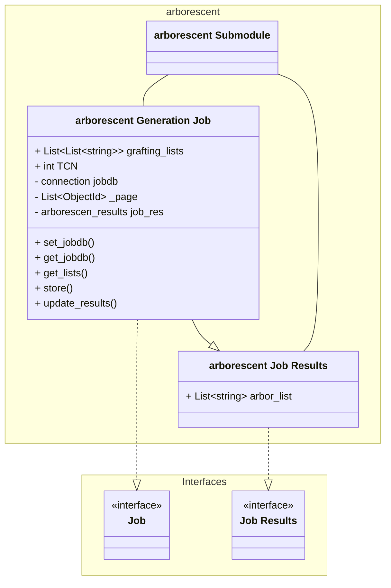
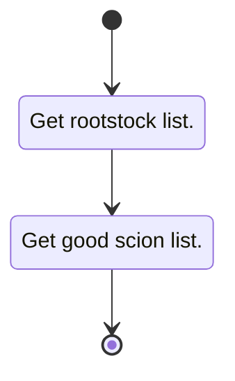
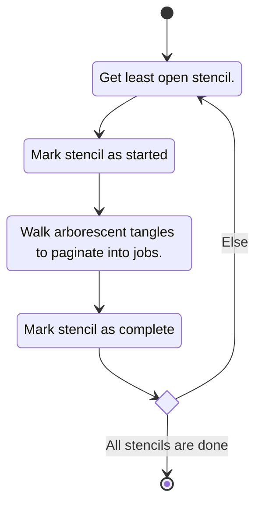
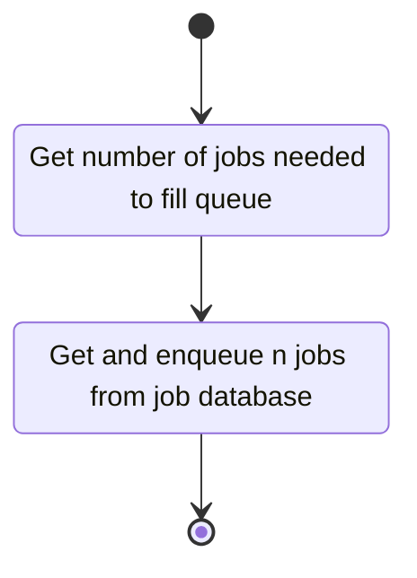
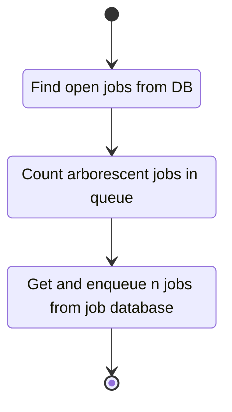
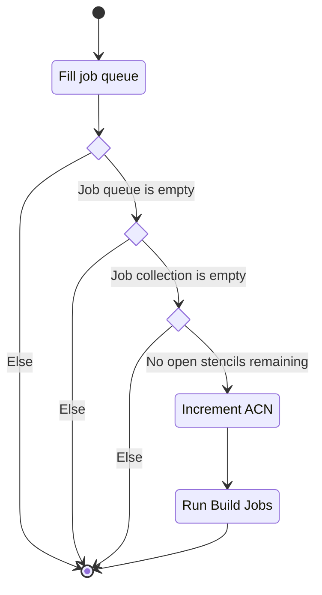
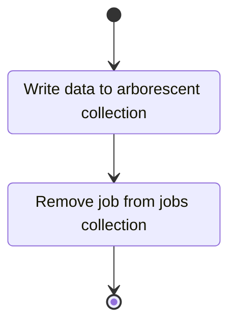

# Unit: Arborescent Job

## Description

Implementation of the Job interface for the arborescent job type.

### Strategy

Info on abstract strategy can be found in the core project.

## Diagrams

### Class diagram

### Get Lists

Retrieve list of arborescent tangles for a job. Next $n$ tangles of a given TCN starting at the
given cursor.

### Build Job

Build and enqueue jobs from stencils into the jobs database store.

### Load Jobs

Load jobs from the job database store into the active job queue.

### Startup

Run at startup to initialize the arborescent use case.

### Time Task

Cyclic task used for maintaining the job queue and general stencil state.

### Store

Logic for committing computed data to the arborescent data store.

## Unit test description

### Get Lists

#### Positive Tests

##### Get lists for jobs

This tests the behavior of the get lists function.

###### Inputs:

- Mocked arborescent collection.
- Mocked job.

###### Expected Output:

The system is expected to generate the correct rootstock and scion lists.

#### Negative Tests

##### Arborescent collection is empty

This tests the behavior of the get lists function when an empty arborescent collection is provided.

###### Inputs:

- Mocked empty arborescent collection.
- Mocked job.

###### Expected Output:

The system is expected to raise an empty arborescent exception.

### Build Jobs

#### Positive Tests

##### Stencils exist and are processed

This tests the behavior of the build function in the case valid stencils are present.

###### Inputs:

- Mocked stencil collection stencils.
- Mocked arborescent collection.

###### Expected Output:

The system is expected to return and enqueue jobs into the mocked jobdb.

#### Negative Tests

##### Stencil collection is empty

This tests the behavior of the build jobs function when an empty stencil collection is provided.

###### Inputs:

- Mocked empty stencil collection.
- Mocked arborescent collection.
- Mocked job collection.

###### Expected Output:

The system is expected to return and enqueue no data.

##### Arborescent collection is empty

This tests the behavior of the build jobs function when an empty arborescent collection is provided.

###### Inputs:

- Mocked valid stencil collection.
- Mocked arborescent collection.
- Mocked job collection.

###### Expected Output:

The system is expected to raise an empty arborescent exception.

### Load Jobs

#### Positive Tests

##### The requested count is 2

This tests the behavior of the get jobs function when the requested count is 2. This is the normal
positive behaviour.

###### Inputs:

- Mocked stencil collection two stencils.
- Mocked arborescent collection.

###### Expected Output:

The system is expected to return and enqueue jobs into the mocked jobdb.

#### Negative Tests

##### Stencil collection is empty

This tests the behavior of the get jobs function when an empty Stencil collection is provided.

###### Inputs:

- Mocked empty stencil collection.
- Mocked arborescent collection.
- Mocked job collection.

###### Expected Output:

The system is expected to return and enqueue no data.

##### Arborescent collection is empty

This tests the behavior of the get jobs function when an empty arborescent collection is provided.

###### Inputs:

- Mocked valid stencil collection.
- Mocked arborescent collection.

###### Expected Output:

The system is expected to raise an empty arborescent exception.

##### Requested count is 0

This tests the behavior of the get jobs function when the requested count is 0.

###### Inputs:

- Mocked valid stencil collection.
- Mocked arborescent collection.

###### Expected Output:

The system is expected to return and enqueue no data.

### Startup Task

#### Positive Tests

##### Load from collection

Successfully loads open jobs from collection.

###### Inputs:

- Mocked valid stencil collection
- Mocked job collection.

###### Expected Output:

Enqueue jobs with the correct id

#### Negative Tests

I can't think of any at the moment.

### Time Task

#### Positive Tests

##### The job queue is filled

Successfully loads open jobs from collection.

###### Inputs:

- Mocked job collection.

###### Expected Output:

Enqueue jobs with the correct id

##### Increment TCN

Tests program flow that increases completed TCN.

###### Inputs:

- Mocked valid stencil collection
- Empty job queue
- Mocked job collection.

###### Expected Output:

Enqueue new jobs.

#### Negative Tests

I can't think of any at the moment.

### Arborescent Job Store

#### Positive Test

Results are stored to database and stencil is updated

##### Inputs:

- Mocked valid stencil collection with min-new-count - 1 open jobs
- Mocked valid arborescent collection

##### Expected Output:

Enqueue jobs with the correct id

#### Negative Tests

I can't think of any at the moment.
