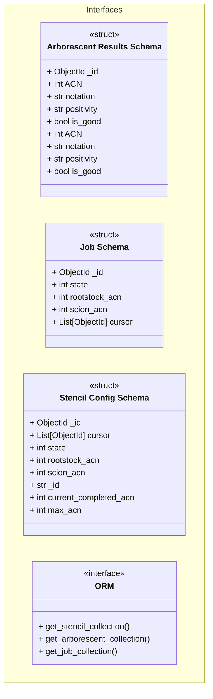

# Unit arborescent ORM

## Description

Describes the ORM module for the arborescent tangle module.

## Diagrams

```mermaid

classDiagram
    namespace Interfaces {
        class schema["Arborescent Schema"] {
            <<struct>>
            + ObjectId _id
            + int ACN
            + str notation
            + str positivity
            + bool is_good
        }

        class schema["Arborescent Results Schema"] {
            <<struct>>
            + int ACN
            + str notation
            + str positivity
            + bool is_good
        }

        class schema_sten_job["Job Schema"] {
            <<struct>>
            + ObjectId _id
            + int state
            + int rootstock_acn
            + int scion_acn
            + List[ObjectId] cursor
        }

        class schema_sten["Stencil Schema"] {
            <<struct>>
            + ObjectId _id
            + List[ObjectId] cursor
            + int state
            + int rootstock_acn
            + int scion_acn
        }

        class schema_sten["Stencil Config Schema"] {
            <<struct>>
            + str _id
            + int current_completed_acn
            + int max_acn
        }

        class age["ORM"] {
            <<interface>>
            + get_stencil_collection()
            + get_arborescent_collection()
            + get_job_collection()
        }
    }
```

## Unit test description

No testing required for data only classes.
